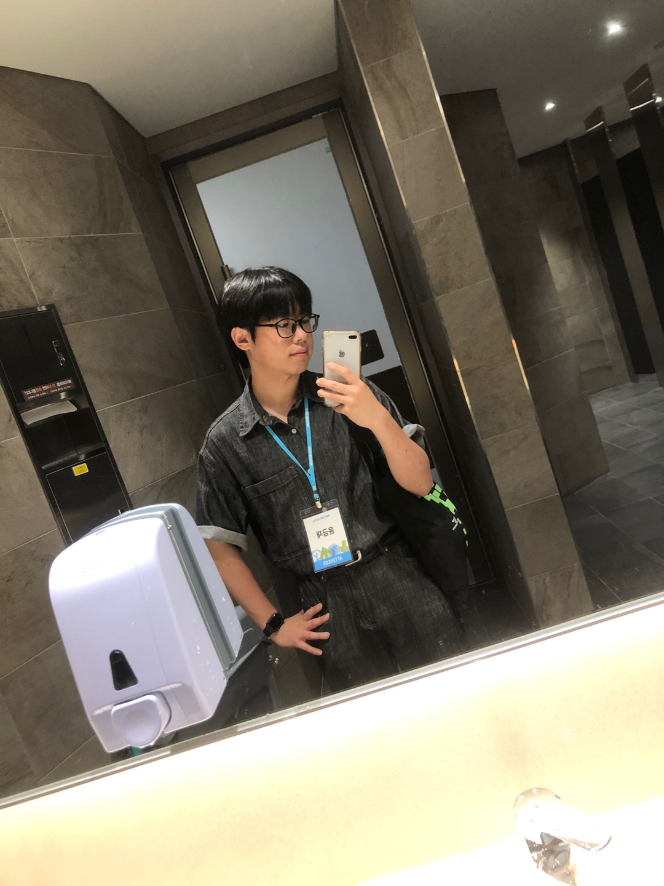

# CloudSkillsChallenge
클라우드 스킬 챌린지로 함께 공부해요!

# 해커그라운드

  

**해커그라운드**는 대구/경북 지역의 청년 개발자들과 함께 [Microsoft 애저 클라우드](https://azure.microsoft.com/ko-kr?WT.mc_id=dotnet-91712-juyoo)를 활용해 당면한 지역의 현안 문제를 해결하는 온/오프라인 개발자 커뮤니티입니다.

**해커그라운드 클라우드 스킬 챌린지** 이벤트에서는 주어진 기간 안에 동료들과 관련 지식을 함께 배웁니다. 이번 챌린지의 주제는 바로 6대 Microsoft 기초 과정입니다. 3주간 스터디 모임별로 공부하고 직접 서비스를 만들어 보는 해커그라운드 클라우드 스킬 챌린지 이벤트! 도전해 보세요. 많은 걸 얻어가실 수 있습니다!

## 🕰 클라우드 스킬 챌린지 일정

- 참가 신청기간: 2024년 3월 7일 0시 - 2024년 4월 2일 23시 59분 👈 참가 신청과 동시에 수강 가능합니다.
- 결과제출 마감기한: 2024년 4월 2일 23시 59분
- 저녁마다 유튜브 스트리밍이 진행될 예정입니다. 상세 링크는 메일로 보내드립니다!

## 🙆🏻‍♀️ 해커그라운드 클라우드 스킬 챌린지 참여 자격

- 참여하고 싶은 누구나 가능합니다!

## 🏃🏻‍♂️ 해커그라운드 클라우드 스킬 챌린지 참여 방법

1. MS Learn 홈페이지의 프로필 링크를 체크합니다.
1. 해커그라운드 클라우드 스킬 챌린지 이벤트에 참가 신청합니다.
1. 참가신청 후 곧바로 수강을 시작합니다.
1. 총 6개의 챌린지 미션을 모두 완료합니다.
1. 각 챌린지 미션을 완료할 때 마다 [이슈를 생성해][submit] 운영진에게 제출합니다.
1. 챌린지 도중 궁금한 사항이 있을 땐 언제든 [디스코드 질문/답변][qna] 채널을 이용해 주세요.

## 🔒 MS Learn 회원가입
1. [Microsoft Learn 홈페이지](https://learn.microsoft.com/ko-kr/)에 들어가서 회원가입을 진행합니다!(Microsoft 계정이 있으시면 로그인해주세요!)
2. MS Learn 프로필 링크를 준비합니다!  

   
   
   

## ✅ 해커그라운드 클라우드 스킬 챌린지 미션

총 **여섯 가지 챌린지 미션**을 완료해야 합니다. 전체 챌린지 미션은 아래와 같습니다.

> 각 챌린지 별로 각각 참가 신청해야 합니다.

1. **[클라우드] 애저 기초 (AZ-900) 챌린지** 👉 [챌린지 바로가기](https://aka.ms/hg/csc/az-900)
1. **[인공지능] 애저 AI 기초 (AI-900) 챌린지** 👉 [챌린지 바로가기](https://aka.ms/hg/csc/ai-900)
1. **[데이터분석] 애저 데이터 기초 (DP-900) 챌린지** 👉 [챌린지 바로가기](https://aka.ms/hg/csc/dp-900)
1. **[BI+앱개발] 파워 플랫폼 기초 (PL-900) 챌린지** 👉 [챌린지 바로가기](https://aka.ms/hg/csc/pl-900)
1. **[보안] 보안 기초 (SC-900) 챌린지** 👉 [챌린지 바로가기](https://aka.ms/hg/csc/sc-900)
1. **[협업툴] Microsoft 365 기초 (MS-900) 챌린지** 👉 [챌린지 바로가기](https://aka.ms/hg/csc/ms-900)

## ✉️ 해커그라운드 클라우드 스킬 챌린지 참여

아래 폼으로 신청시 관련 안내 메일을 보내드릴 예정입니다.

- [클라우드 스킬 챌린지 지금 신청하기](https://aka.ms/hg/csc/register) 👈 등록과 동시에 수강 가능합니다.

## 🧑‍💻 친구와 함께하기

친구와 함께 진행하실 분들은 현재 메일 혹은 아래 링크를 공유해주세요!
* [클라우드 스킬 챌린지](https://aka.ms/hg/csc): https://aka.ms/hg/csc

## 챌린지 끝나면 자격증 시험치자!

- 미션을 완주하신 분들은 온라인으로 집에서 편히 자격증 시험에 응시할 수 있습니다.
- 마이크로소프트에서 발급하는 국제공인자격증으로써 졸업요건, 전문성 입증 등에 사용될 수 있습니다.
- 미션별 홈페이지 하단의 자격증 시험 개요를 참고하세요!

## 챌린지 스트리밍 진행자

   
  

    <a href="" target="_blank" title="해커그라운드 김근찬">
        
    </a>
    
해커그라운드 김근찬

  

  

    <a href="" target="_blank" title="경북대 Get IT 김근희">
        
    </a>
    
경북대 Get IT 김근희

  

  

    <a href="" target="_blank" title="해커그라운드 박찬욱">
        
    </a>
    
해커그라운드 박찬욱

  

  

    <a href="" target="_blank" title="영남대 멋쟁이사자처럼 윤금재">
        
    </a>
    
영남대 멋쟁이사자처럼 윤금재

  

  

    <a href="" target="_blank" title="경북대 블로캠 이상엽">
        
    </a>
    
경북대 블로캠 이상엽

  

  

    <a href="" target="_blank" title="계명대 멋쟁이사자처럼 이시영">
        
    </a>
    
계명대 멋쟁이사자처럼 이시영

  

  

    <a href="" target="_blank" title="경북대 MLSA 조해민">
        
    </a>
    
경북대 MLSA 조해민

  

  

    <a href="" target="_blank" title="경북대 L&C 황지현">
        
    </a>
    
경북대 L&C 황지현

  

---

## 🎭 해커그라운드 개인정보 보호정책

해커그라운드는 여러분의 개인 정보를 소중히 여깁니다. 개인 정보 보호와 관련한 자세한 내용은 [개인정보 보호정책][privacy] 페이지를 참고해 주세요.

## 👨‍👩‍👧‍👦 해커그라운드 행동 강령 Code of Conduct

해커그라운드는 참가자 여러분들 모두가 행사 기간 중 마음 편안하게 참여하실 수 있게끔 모두에게 공정하고 상호 존중하도록 행동 강령을 정하고 있습니다. 좀 더 자세한 내용은 [행동 강령][coc] 페이지를 참고해 주세요.

## 🥑 주최

이 행사는 Microsoft에서 주최합니다.
&nbsp;

   

  &nbsp;

## 🥑 주관

이 행사는 (주)해달프로그래밍에서 주관합니다.
&nbsp;

   

  

[qna]: https://aka.ms/hg/discord
[privacy]: https://github.com/microsoft/hackers-ground/blob/main/PRIVACY_POLICY.md
[coc]: https://github.com/microsoft/hackers-ground/blob/main/CODE_OF_CONDUCT.md

